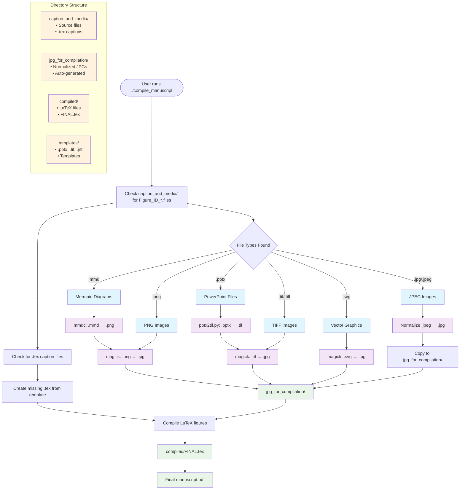

# Figure Management in SciTex

This directory contains all figure-related files for the manuscript. SciTex uses a structured approach to manage figures efficiently.

## Quick Start Guide

### Adding a New Figure

1. **Create your figure** in PNG, TIF/TIFF, SVG, JPG/JPEG, PowerPoint (.pptx), or Mermaid (.mmd) format (300 DPI recommended)
2. **Name it properly**: `Figure_ID_XX_description.[ext]` (e.g., `Figure_ID_01_workflow.png`)
3. **Place it in**: `caption_and_media/` directory
4. **Create a caption file**: `Figure_ID_XX_description.tex` with the same base name
5. **Reference it in text**: Use `Figure~\ref{fig:XX_description}` (e.g., `Figure~\ref{fig:01_workflow}`)
6. **Compile**: Run `./compile_manuscript` (figures are processed automatically)

## Directory Structure

- `caption_and_media/`: Source directory for all figure files and captions
  - Place your image files here (PNG, TIF/TIFF, SVG, JPG/JPEG, PowerPoint .pptx, or Mermaid .mmd)
  - For each image, create a matching `.tex` caption file with the same base name
  - `jpg_for_compilation/`: Auto-generated directory containing normalized JPG versions for LaTeX compilation
- `compiled/`: Contains compiled LaTeX files for each figure (auto-generated)
- `templates/`: Templates for figure creation

## Naming Conventions

All figures must follow this naming pattern:

```
Figure_ID_XX_descriptive_name.[png|tex]
```

Where:
- `Figure_ID` is the fixed prefix (required)
- `XX` is a two-digit figure number (e.g., 01, 02)
- `descriptive_name` is an optional descriptive name (e.g., workflow, architecture)
- Supported extensions: `.png`, `.tif/.tiff`, `.svg`, `.jpg/.jpeg`, `.pptx` (PowerPoint), `.mmd` (Mermaid), and `.tex` for caption files

**Important**: The LaTeX reference label is generated as `\label{fig:XX_descriptive_name}` based on the full filename.

## Caption Format

For each figure, create a caption file with the same name but `.tex` extension:

```latex
\caption{\textbf{
FIGURE TITLE HERE
}
\smallskip
\\
FIGURE LEGEND HERE. Provide a detailed description of the figure including all components and their significance.
}
% width=1\textwidth
```

Adjust figure width by modifying the `width=1\textwidth` comment. This width specification will be automatically used when compiling figures.

## Figure Compilation

When you compile with `./compile_manuscript`, SciTex automatically:

1. Converts Mermaid diagrams (.mmd) to PNG
2. Converts all image formats (TIF, PNG, SVG) to JPG for consistent LaTeX compilation
3. **Creates placeholders for missing figures** - if a .tex caption exists but no source image, automatically generates a placeholder JPG
4. Creates a dedicated "Figures" section at the end of the document
5. Formats each figure with proper spacing, bookmarks, and labels
6. Creates one figure per page in the final PDF

## Final Figure Format in Manuscript

Each figure in the final manuscript will appear like this:

```latex
\clearpage
\begin{figure*}[ht]
    \pdfbookmark[2]{ID XX}{figure_id_XX}
    \centering
    \includegraphics[width=1\textwidth]{./contents/figures/png/Figure_ID_XX.png}
    \caption{\textbf{
    FIGURE TITLE HERE
    }
    \smallskip
    \\
    FIGURE LEGEND HERE.
    }
    % width=1\textwidth
    \label{fig:XX}
\end{figure*}
```

## Supported Image Formats

### Mermaid Diagrams (.mmd)
Create flowcharts, diagrams, and visualizations using Mermaid syntax. These are automatically converted to PNG/JPG during compilation.

**Figure Processing Workflow:**


This diagram shows the complete figure processing workflow with file type priorities and directory structure.

### TIF/TIFF Images
High-quality raster images commonly used for publication. Automatically converted to JPG for LaTeX.

### SVG Vector Graphics
Scalable vector graphics. Automatically converted to JPG for LaTeX compatibility.

### PNG/JPG Images
Standard web formats. PNG files are converted to JPG for consistency.

### PowerPoint to TIF Conversion
Convert PowerPoint slides to TIF format using:
```bash
./compile_manuscript --pptx2tif
```
**Note:** Requires Windows with PowerPoint (via WSL).

## Placeholder Mechanism

When a `.tex` caption file exists but no corresponding source image is found, SciTex automatically creates a placeholder:

### Placeholder Priority
1. **Template-based**: Uses `templates/FIGURE_ID_00_TEMPLATE.tif` and converts to JPG
2. **Generated fallback**: Creates a gray 800x600 image with "Figure Placeholder" text

### Placeholder Benefits
- **Prevents compilation errors**: Missing figures don't break the PDF generation
- **Visual feedback**: Clearly shows which figures need source files
- **Maintains layout**: Preserves document structure during development
- **Easy identification**: Placeholder text includes the figure ID

### Example Workflow
```bash
# 1. Create caption file first
echo '\caption{My new figure caption}' > caption_and_media/Figure_ID_02_analysis.tex

# 2. Compile manuscript - placeholder automatically created
./compile_manuscript

# 3. Add actual source file later
cp my_analysis.png caption_and_media/Figure_ID_02_analysis.png

# 4. Recompile - real figure replaces placeholder
./compile_manuscript
```

## Example Structure

```
figures/
├── caption_and_media/      # Source files
│   ├── Figure_ID_00_template.tif    # Template figure
│   ├── Figure_ID_00_template.tex    # Template caption
│   ├── Figure_ID_01_workflow.mmd    # Mermaid diagram source
│   ├── Figure_ID_01_workflow.png    # Generated from .mmd
│   ├── Figure_ID_01_workflow.tex    # Caption file
│   └── jpg_for_compilation/         # Auto-generated/normalized JPGs
│       ├── Figure_ID_00_template.jpg   # Converted from TIF
│       └── Figure_ID_01_workflow.jpg   # Converted from PNG
├── compiled/               # Auto-generated LaTeX
│   ├── FINAL.tex                    # Combined figures file
│   ├── Figure_ID_00_template.tex    # Compiled figure
│   └── Figure_ID_01_workflow.tex    # Compiled figure
└── templates/              # Templates
    └── _Figure_ID_00_TEMPLATE.jnt   # SigmaPlot template file
```

## For More Information

See the comprehensive figure and table management guide in the documentation:

```
/docs/FIGURE_TABLE_GUIDE.md
```