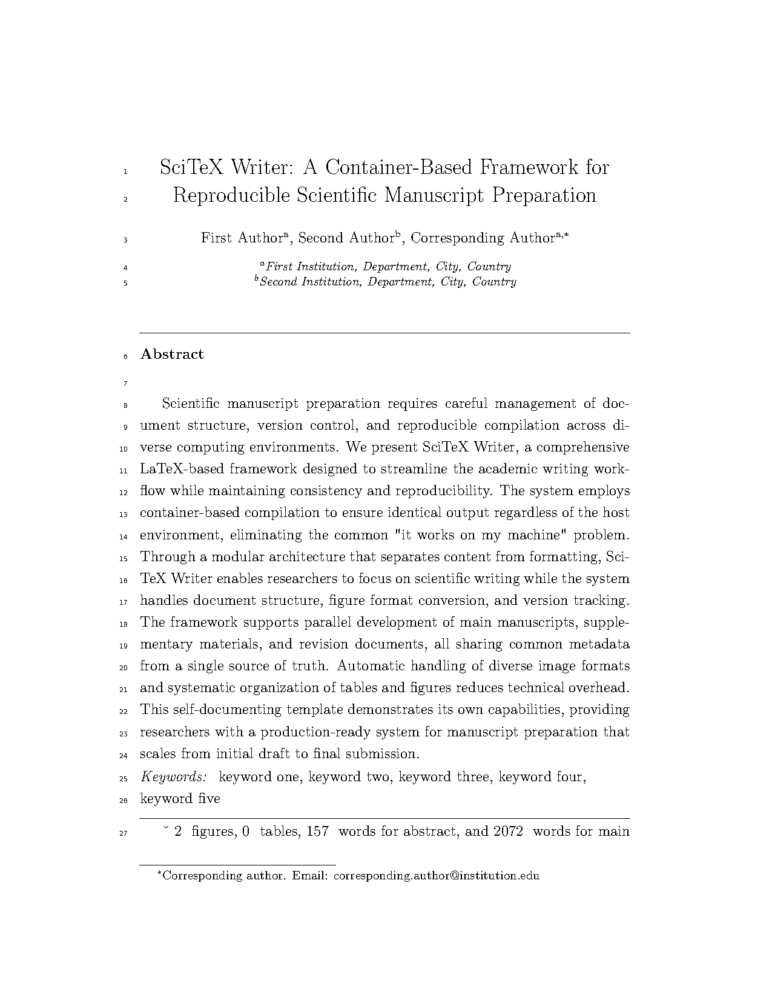
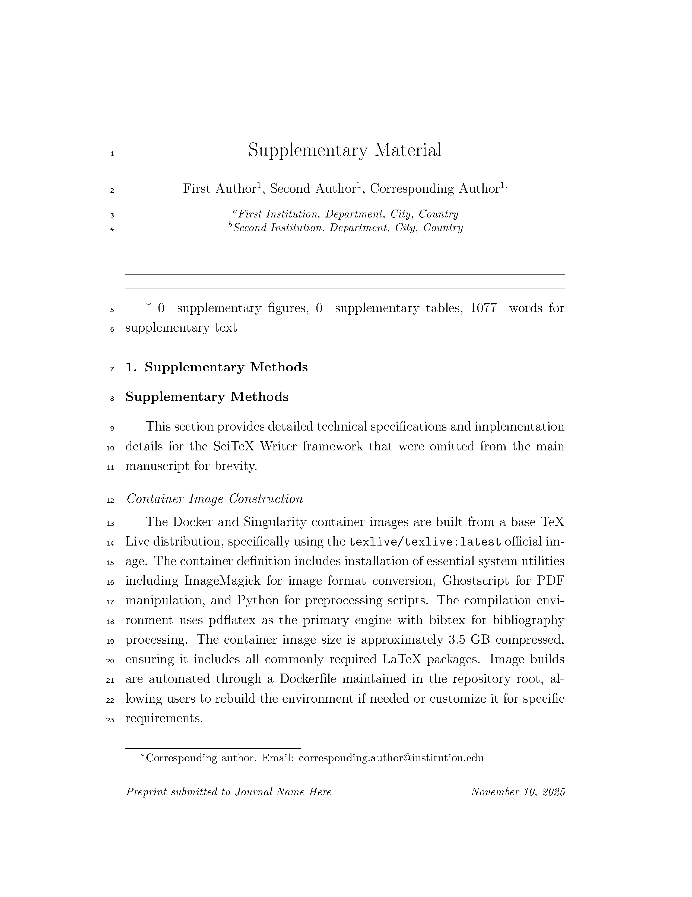
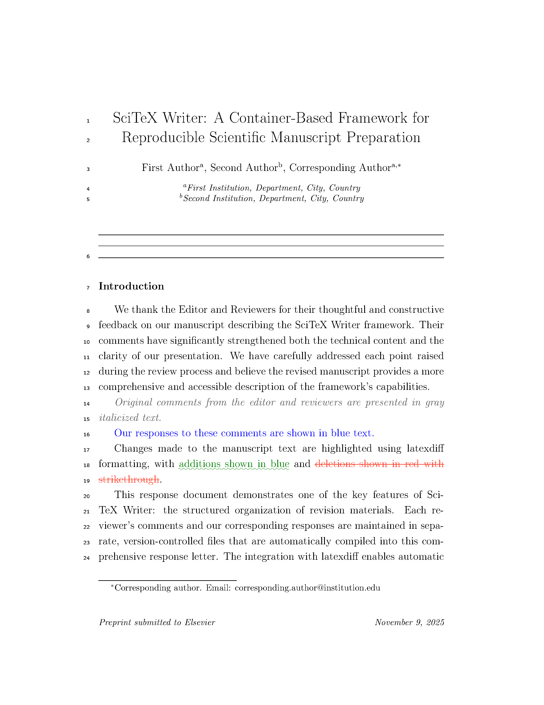

<!-- ---
!-- Timestamp: 2026-01-09 13:47:25
!-- Author: ywatanabe
!-- File: /home/ywatanabe/proj/scitex-writer/README.md
!-- --- -->

<p align="center">
  
</p>

<h1 align="center">SciTeX Writer</h1>

<p align="center">
  LaTeX compilation system for academic manuscripts
</p>

<p align="center">
  <a href="https://scitex.ai">scitex.ai</a> •
  <a href="docs/">Documentation</a> •
  <a href="https://github.com/ywatanabe1989/scitex-writer/issues">Issues</a>
</p>

<p align="center">
  <a href="https://github.com/ywatanabe1989/scitex-writer/actions/workflows/comprehensive-tests.yml">
    
  </a>
  <a href="https://github.com/ywatanabe1989/scitex-writer/actions/workflows/compile-test.yml">
    
  </a>
  <a href="https://codecov.io/gh/ywatanabe1989/scitex-writer">
    
  </a>
  <a href="https://github.com/ywatanabe1989/scitex-writer/actions/workflows/lint.yml">
    
  </a>
</p>

---

## Quick Start

```bash
# Clone or use template
git clone https://github.com/ywatanabe1989/scitex-writer.git
cd scitex-writer

# Try compiling (checks dependencies automatically)
./scripts/shell/compile_manuscript.sh

# If dependencies missing, install suggested packages and retry
```

## Demo

<table>
<tr>
<td width="33%" align="center">
  <a href="01_manuscript/manuscript.pdf">
    
  </a>
  <br/>
  <sub><a href="01_manuscript/manuscript.pdf">📄 Manuscript</a></sub>
  <br/>
  <sub><a href="scripts/shell/.compile_manuscript.sh.log">📄 Compilation Log</a></sub>
</td>
<td width="33%" align="center">
  <a href="02_supplementary/supplementary.pdf">
    
  </a>
  <br/>
  <sub><a href="02_supplementary/supplementary.pdf">📄 Supplementary</a></sub>
  <br/>
  <sub><a href="scripts/shell/.compile_supplementary.sh.log">📄 Compilation Log</a></sub>  
</td>
<td width="33%" align="center">
  <a href="03_revision/revision.pdf">
    
  </a>
  <br/>
  <sub><a href="03_revision/revision.pdf">📄 Revision</a></sub>
  <br/>
  <sub><a href="scripts/shell/.compile_revision.sh.log">📄 Compilation Log</a></sub>
</td>
</tr>
</table>

## Installation

Dependencies are checked automatically during compilation. Quick install options:

**Native LaTeX (Ubuntu/Debian):**
```bash
sudo apt-get install texlive-latex-extra latexdiff parallel imagemagick ghostscript
git clone https://github.com/ywatanabe1989/scitex-writer.git
cd scitex-writer
./scripts/shell/compile_manuscript.sh
```

**macOS:**
```bash
brew install texlive latexdiff parallel imagemagick ghostscript
git clone https://github.com/ywatanabe1989/scitex-writer.git
cd scitex-writer
./scripts/shell/compile_manuscript.sh
```

**HPC/Containers:**
- Module system: `module load texlive latexdiff parallel`
- Docker: `docker run -v $(pwd):/work scitex-writer`
- Singularity: `singularity run scitex-writer.sif`

**👉 See [Full Installation Guide](docs/01_GUIDE_INSTALLATION.md) for detailed instructions by environment.**

## Minimal Template

To create a minimal template with less example content (Issue #14):

```bash
git clone https://github.com/ywatanabe1989/scitex-writer.git my-paper
cd my-paper

# Strip all example content and keep only essential structure
./scripts/repository_maintenance/strip_example_content.sh

# Now you have a clean slate with just the necessary structure
./compile.sh manuscript
```

This removes:
- Example figure and table files
- Archive versions
- Example content from abstract, introduction, methods, results, discussion
- Generated JPG cache

**Result:** A clean project structure ready for your content (~5MB instead of ~50MB)

## Features

### Core Capabilities

- **Multi-Engine Compilation System**
  - Auto-detection of best available engine (Tectonic, latexmk, 3-pass)
  - Tectonic: Ultra-fast mode (1-3s incremental, 10× faster)
  - latexmk: Standard mode (3-6s incremental, industry standard)
  - 3-pass: Guaranteed mode (12-18s, maximum compatibility)
  - Hot-recompile mode with file watching for rapid iteration

- **Smart Bibliography Management**
  - Multi-file bibliography with automatic deduplication
  - DOI-based and title+year matching
  - 20+ citation styles (APA, Chicago, IEEE, Nature, MLA, etc.)
  - Easy style switching via YAML configuration

- **Version Control Integration**
  - Automatic archiving with version numbering
  - Built-in diff generation using latexdiff
  - Git auto-commit with semantic versioning
  - Complete revision history tracking

- **Automated Asset Processing**
  - Parallel figure processing (PNG, JPEG, SVG, PDF, TIFF, Mermaid)
  - Automatic table compilation from CSV files
  - Format conversion and optimization
  - Template-based figure and table generation

- **Cross-Platform Reproducibility**
  - Container support (Docker, Apptainer/Singularity)
  - Native execution on Linux, macOS, Windows (WSL2)
  - HPC cluster compatibility
  - Byte-for-byte identical outputs across platforms

- **Performance Optimizations**
  - Hash-based caching for incremental compilation
  - Parallel processing for figures, tables, and word count
  - Smart recompilation (only process changed files)
  - Draft mode for rapid iteration

## Usage

### Basic Compilation

```bash
# Compile manuscript (auto-detects best engine)
./scripts/shell/compile_manuscript.sh

# Compile supplementary materials
./scripts/shell/compile_supplementary.sh

# Compile revision response letter
./scripts/shell/compile_revision.sh
```

### Advanced Compilation Options

```bash
# Fast compilation (draft mode, skip figures/tables)
./scripts/shell/compile_manuscript.sh --draft

# Skip specific components
./scripts/shell/compile_manuscript.sh --no-figs      # Skip figure processing
./scripts/shell/compile_manuscript.sh --no-tables    # Skip table processing
./scripts/shell/compile_manuscript.sh --no-diff      # Skip diff generation

# Force specific compilation engine
./scripts/shell/compile_manuscript.sh --engine tectonic
./scripts/shell/compile_manuscript.sh --engine latexmk
./scripts/shell/compile_manuscript.sh --engine 3pass

# Enable hot-recompile mode (watches files for changes)
./scripts/shell/compile_manuscript.sh --watch

# Clean build (remove cache and temporary files)
./scripts/shell/compile_manuscript.sh --clean
```

### Bibliography Management

```bash
# Organize references by topic in separate .bib files
cd 00_shared/bib_files/
vim methods_refs.bib
vim field_background.bib
vim my_papers.bib

# References auto-merge and deduplicate during compilation
./scripts/shell/compile_manuscript.sh

# Change citation style (edit config/config_manuscript.yaml)
# Options: unsrtnat, plainnat, apalike, IEEEtran, naturemag, etc.
```

### Version Control and Diff Generation

```bash
# Archive current version (auto-increments version number)
git add .
git commit -m "Revisions for reviewer comments"
# Version archived automatically via git hooks

# Generate diff from previous version
./scripts/shell/compile_manuscript.sh --diff

# View archived versions
ls -lt 01_manuscript/archive/
```

## Documentation

- [Installation Guide](docs/01_GUIDE_INSTALLATION.md) - Complete setup instructions for all environments
- [Quick Start](docs/01_GUIDE_QUICK_START.md) - Common tasks and workflows
- [Content Creation](docs/01_GUIDE_CONTENT_CREATION.md) - Writing manuscripts, figures, tables
- [Bibliography Management](docs/01_GUIDE_BIBLIOGRAPHY.md) - Managing references and citations
- [Architecture](docs/02_ARCHITECTURE_IMPLEMENTATION.md) - Technical implementation details
- [Full Documentation](docs/00_INDEX.md) - All guides and resources

<!-- ## Testing
 !-- 
 !-- ### Running Tests
 !-- 
 !-- ```bash
 !-- # Run all tests
 !-- ./tests/run_all_tests.sh
 !-- 
 !-- # Run specific test suites
 !-- ./tests/scripts/test_compile_options.sh  # Compilation options
 !-- ./tests/scripts/test_dark_mode.sh        # Dark mode features
 !-- ./tests/scripts/test_performance.sh      # Performance optimizations
 !-- ```
 !-- 
 !-- ### Test Coverage
 !-- 
 !-- - **30+ tests** covering all features
 !-- - **Shell Script Tests**: 30 tests
 !--   - Compilation options (10 tests)
 !--   - Dark mode functionality (10 tests)
 !--   - Performance optimizations (10 tests) -->

### Continuous Integration

All tests run automatically on GitHub Actions:
- ✅ Full compilation with PDF validation
- ✅ Fast mode (`--no_figs --no_diff`)
- ✅ Ultra-fast mode (`--draft --no_tables`)
- ✅ Dark mode (`--dark-mode`)
- ✅ All document types (manuscript, supplementary, revision)
- ✅ Option name flexibility (hyphens/underscores)


---

<p align="center">
  <a href="https://scitex.ai" target="_blank"></a>
  <br>
  AGPL-3.0 · ywatanabe@scitex.ai
</p>

    <!-- EOF -->

<!-- EOF -->