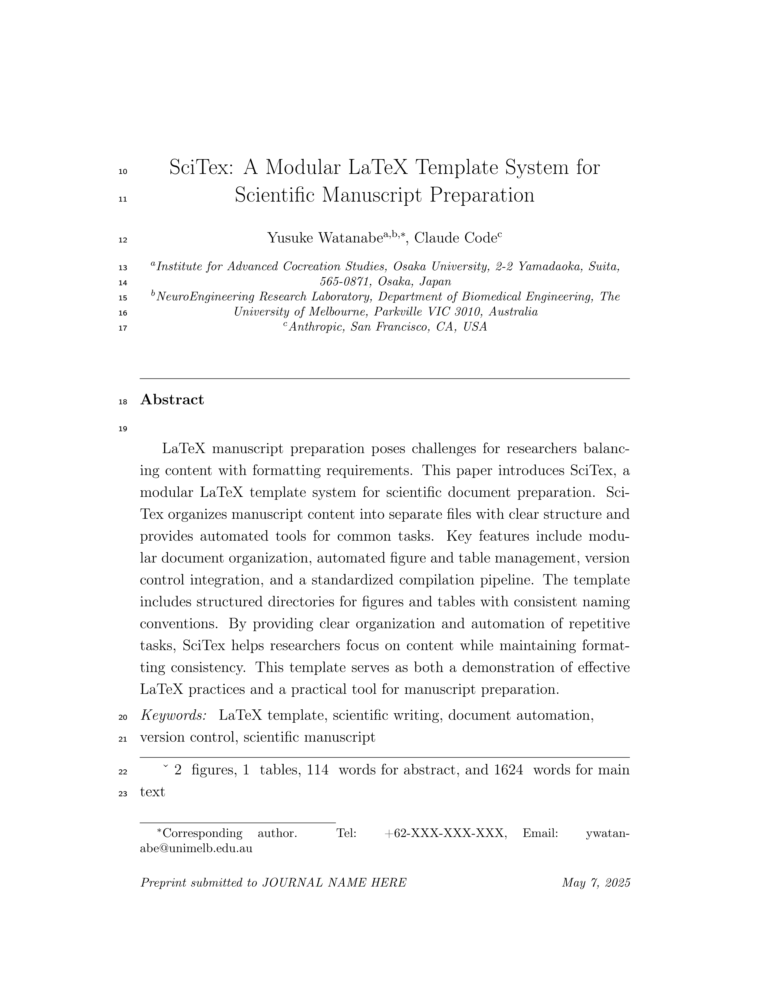
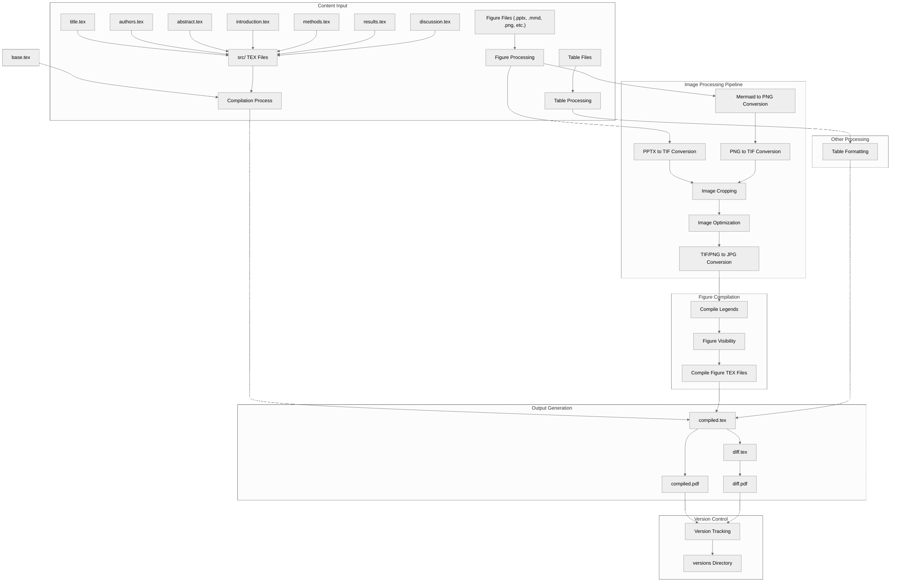

<!-- ---
!-- Timestamp: 2025-05-07 06:17:41
!-- Author: ywatanabe
!-- File: /home/ywatanabe/proj/SciTex/README.md
!-- --- -->

# SciTex: Scientific Manuscripts Compilation System using LaTeX

<!-- 
 !-- 
 !--  -->

<!-- SciTex is a LaTeX template system for scientific manuscript preparation from text and media files. It complies with [Elsevier's manuscript guidelines](https://www.elsevier.com/researcher/author/policies-and-guidelines/latex-instructions) while remaining adaptable for other journals. -->

<p align="center">
  <a href="./manuscript/compiled.pdf">
    
  </a>
  <a href="./manuscript/compiled.pdf">
    
  </a>  
</p>


## Key Features

- **Text, Figure, and Table Management with Separation of Concerns** 
- **Manuscript version tracking**
- **manuscript, Revision, and Supplementary Material Modes**: 

## Installation

### Installation on Ubuntu

```bash
$ ./manuscript/scripts/shell/install_on_ubuntu.sh # Install LaTeX and system dependencies
$ ./manuscript/scripts/shell/gen_pyenv.sh # Set up Python environment
```

### Set Up OpenAI API

```bash
$ echo 'export OPENAI_API_KEY="YOUR_OPENAI_API_KEY"' >> ~/.bashrc
$ source ~/.bashrc
```

## Quick Start

```bash
$ cd manuscript && ./main
$ cd supplementary && ./main
$ cd revision && ./main
```

## Project Structure


SciTex organizes content into three main components:

- **manuscript/**: Main scientific manuscript
  - `structure.tex`: Base structure of manuscript
  - `src/`: Source files to edit (e.g., Title, Authors, IMRaD, Citations, figures/tables, and so on)
  - `scripts/`: Compilation scripts

- **revision/**: Revision response documents
  - `src/reviewer*/`: Reviewer-specific comments and responses
  - `src/editor/`: Editor comments and responses

- **supplementary/**: Supplementary materials
  - `src/`: Additional content, figures, and tables

## Basic Workflow

1. **Create Content**:
   - Edit section files in `manuscript/src/*.tex`
     - `title.tex`
     - `authors.tex`
	 - `journal_name.tex`
     - `highlights.tex`
     - `abstract.tex`
     - `introduction.tex`
     - `methods.tex`
     - `results.tex`
     - `discussion.tex`

   - Prepare references in `manuscript/src/bibliography.bib`
     - Use `\cite{<index-tag>}` in tex files (e.g., `\cite{Johnson2023}` )

   - Add figures to `manuscript/src/figures/src/Figure_<id>_<label>.tif`
     - Use `Figure~\ref{fig:<id>_<label>}` in tex files

   - Add tables to `manuscript/src/tables/src/Table_<id>_<label>.csv`
     - Use `Figure~\ref{tab:<id>_<label>}` in tex files

   - For details, see:
     - [Figure and Table Guide](./docs/FIGURE_TABLE_GUIDE.md)

2. **Compile Manuscript as PDF**:
   ```bash
   $ cd manuscript && ./main
   ```
3. **(Optional) Manage Figures**:
   ```bash
   # From manuscript directory
   $ cd manuscript && ./main --pptx2tif  # Convert PowerPoint to TIF
   $ cd manuscript && ./main --no-figures  # Compile without figures
   ```

4. **(Optional) Use AI Assistance**:
   ```bash
   # From the manuscript directory
   $ cd manuscript && ./main -r  # Revise text with GPT
   $ cd manuscript && ./main -t  # Check terminology
   $ cd manuscript && ./main -c  # Insert citations
   ```

## Contact

Yusuke Watanabe (ywatanabe@alumni.u-tokyo.ac.jp)

<!-- EOF -->