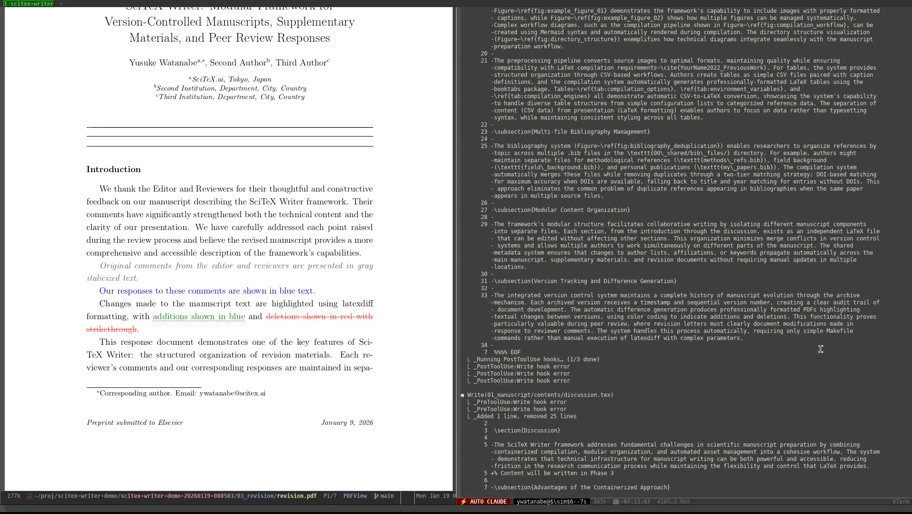

<!-- ---
!-- Timestamp: 2026-01-19 04:54:16
!-- Author: ywatanabe
!-- File: /home/ywatanabe/proj/scitex-writer/README.md
!-- --- -->

<p align="center">
  <a href="https://scitex.ai">
    
  </a>
</p>

<p align="center">
  <a href="https://badge.fury.io/py/scitex-writer"></a>
  <a href="https://pypi.org/project/scitex-writer/"></a>
  <a href="https://github.com/ywatanabe1989/scitex-writer/blob/main/LICENSE"></a>
</p>

<p align="center">
  <a href="https://scitex.ai">scitex.ai</a> · <code>pip install scitex-writer</code>
</p>

---

**LaTeX compilation system for scientific manuscripts with automatic versioning, diff generation, and cross-platform reproducibility.**

Part of the [SciTeX](https://scitex.ai) ecosystem — empowers both human researchers and AI agents.

## 🎬 Demo

<p align="center">
  <a href="https://scitex.ai/media/videos/scitex-writer-v2.2.0-demo.mp4">
    
  </a>
</p>

📄 Demo prompt and progress report ([org](examples/scitex-writer-v2.2.0-demo.org) | [pdf](examples/scitex-writer-v2.2.0-demo.pdf)) | [Manuscript output](examples/scitex-writer-v2.2.0-demo-manuscript.pdf) | [Revision output](examples/scitex-writer-v2.2.0-demo-revision.pdf)

## 📦 Installation

```bash
# LaTeX dependencies (Ubuntu/Debian)
sudo apt-get install texlive-latex-extra latexdiff parallel imagemagick ghostscript

# LaTeX dependencies (macOS)
brew install texlive latexdiff parallel imagemagick ghostscript

# Python package + MCP server
pip install scitex-writer
```

## Quick Start

```bash
git clone https://github.com/ywatanabe1989/scitex-writer.git my-paper
cd my-paper && make manuscript   # or: ./compile.sh manuscript
```

## Four Interfaces

| Interface | For | Description |
|-----------|-----|-------------|
| 📜 **Shell/Make** | Direct compilation | `make manuscript`, `./compile.sh` |
| 🐍 **Python API** | Human researchers | `import scitex_writer as sw` |
| 🖥️ **CLI Commands** | Terminal users | `scitex-writer compile`, `scitex-writer bib` |
| 🔧 **MCP Tools** | AI agents | 28 tools for Claude/GPT integration |

<details>
<summary><strong>📜 Shell Scripts / Make</strong></summary>

<br>

```bash
# Make commands (recommended)
make manuscript              # Compile manuscript
make supplementary           # Compile supplementary
make revision                # Compile revision
make all                     # Compile all documents
make clean                   # Remove build artifacts

# Shell scripts (direct)
./compile.sh manuscript --draft       # Fast single-pass
./compile.sh manuscript --no-figs     # Skip figures
./compile.sh manuscript --no-tables   # Skip tables
./compile.sh manuscript --watch       # Hot-reload
```

</details>

<details>
<summary><strong>🐍 Python API</strong></summary>

<br>

**Compile** — Build PDFs

```python
import scitex_writer as sw

sw.compile.manuscript("./my-paper")                    # Full compile
sw.compile.manuscript("./my-paper", draft=True)       # Fast draft mode
sw.compile.supplementary("./my-paper")
sw.compile.revision("./my-paper", track_changes=True)
```

**Tables/Figures/Bib** — CRUD Operations

```python
# Tables
sw.tables.list("./my-paper")
sw.tables.add("./my-paper", "results", "a,b\n1,2", "Results summary")
sw.tables.remove("./my-paper", "results")

# Figures
sw.figures.list("./my-paper")
sw.figures.add("./my-paper", "fig01", "./plot.png", "My figure")
sw.figures.remove("./my-paper", "fig01")

# Bibliography
sw.bib.list_files("./my-paper")
sw.bib.add("./my-paper", "@article{Smith2024, title={...}}")
sw.bib.merge("./my-paper")  # Merge + deduplicate
```

**Guidelines** — IMRAD Writing Tips

```python
sw.get_guideline("abstract")
sw.build_guideline("abstract", draft="Your draft...")
sw.list_guidelines()  # ['abstract', 'introduction', 'methods', 'discussion', 'proofread']
```

**Prompts** — AI2 Asta

```python
from scitex_writer import generate_asta
result = generate_asta("./my-paper", search_type="related")
```

</details>

<details>
<summary><strong>🖥️ CLI Commands</strong></summary>

<br>

```bash
scitex-writer --help                           # Show all commands

# Compile - Build PDFs
scitex-writer compile manuscript               # Compile manuscript
scitex-writer compile manuscript --draft       # Fast single-pass
scitex-writer compile supplementary            # Compile supplementary
scitex-writer compile revision                 # Compile revision letter

# Bibliography - Reference management
scitex-writer bib list-files                   # List .bib files
scitex-writer bib list-entries                 # List all entries
scitex-writer bib get Smith2024                # Get specific entry
scitex-writer bib add '@article{...}'          # Add entry
scitex-writer bib remove Smith2024             # Remove entry
scitex-writer bib merge                        # Merge and deduplicate

# Tables - CSV↔LaTeX management
scitex-writer tables list                      # List tables
scitex-writer tables add results data.csv "Caption"
scitex-writer tables remove results

# Figures - Image management
scitex-writer figures list                     # List figures
scitex-writer figures add fig01 plot.png "Caption"
scitex-writer figures remove fig01

# Guidelines - IMRAD writing tips
scitex-writer guidelines list                  # List available sections
scitex-writer guidelines abstract              # Get abstract guidelines
scitex-writer guidelines abstract -d draft.tex # Build prompt with draft

# Prompts - AI2 Asta integration
scitex-writer prompts asta                     # Generate related papers prompt
scitex-writer prompts asta -t coauthors        # Find collaborators

# MCP server management
scitex-writer mcp list-tools                   # List all MCP tools (markdown)
scitex-writer mcp doctor                       # Check server health
scitex-writer mcp installation                 # Show Claude Desktop config
scitex-writer mcp start                        # Start MCP server
```

</details>

<details>
<summary><strong>🔧 MCP Tools — 28 tools for AI Agents</strong></summary>

<br>

Turn AI agents into autonomous manuscript compilers.

| Category | Tools | Description |
|----------|-------|-------------|
| project | 4 | Clone, info, PDF paths, document types |
| compile | 3 | Manuscript, supplementary, revision |
| tables | 5 | CSV↔LaTeX, list/add/remove tables |
| figures | 5 | Convert, render PDF, list/add/remove |
| bib | 6 | List files/entries, CRUD, merge/dedupe |
| guidelines | 3 | List, get, build with draft |
| prompts | 1 | AI2 Asta prompt generation |
| usage | 1 | Project guide |

**Claude Desktop** (`~/.config/Claude/claude_desktop_config.json`):

```json
{
  "mcpServers": {
    "scitex-writer": {
      "command": "scitex-writer",
      "args": ["mcp", "start"]
    }
  }
}
```

→ **[Full MCP tool reference](./docs/MCP_TOOLS.md)**

</details>

<details>
<summary><strong>Output Structure</strong></summary>

```
./scitex-writer/
├── 00_shared/                  # Shared resources across all documents
│   ├── title.tex               # Manuscript title
│   ├── authors.tex             # Author names and affiliations
│   ├── keywords.tex            # Keywords for the manuscript
│   ├── journal_name.tex        # Target journal name
│   ├── bib_files/              # Multiple .bib files (auto-merged and deduplicated)
│   ├── latex_styles/           # Common LaTeX configurations
│   └── templates/              # LaTeX document templates
│
├── 01_manuscript/              # Main manuscript
│   ├── contents/               # Modular content sections
│   │   ├── abstract.tex
│   │   ├── introduction.tex
│   │   ├── methods.tex
│   │   ├── results.tex
│   │   ├── discussion.tex
│   │   ├── figures/            # Figure captions + media
│   │   └── tables/             # Table captions + CSV data
│   ├── archive/                # Version history (gitignored)
│   ├── manuscript.tex          # Compiled LaTeX
│   ├── manuscript_diff.tex     # Change-tracked version
│   └── manuscript.pdf          # Output PDF
│
├── 02_supplementary/           # Supplementary materials
│   ├── contents/               # Supplementary content sections
│   │   ├── supplementary_methods.tex
│   │   ├── supplementary_results.tex
│   │   ├── figures/            # Supplementary figures
│   │   └── tables/             # Supplementary tables
│   ├── archive/                # Version history (gitignored)
│   ├── supplementary.tex       # Compiled LaTeX
│   └── supplementary.pdf       # Output PDF
│
├── 03_revision/                # Revision response letter
│   ├── contents/               # Reviewer responses
│   │   ├── editor/             # E_01_comments.tex, E_01_response.tex
│   │   ├── reviewer1/          # R1_01_comments.tex, R1_01_response.tex
│   │   └── reviewer2/          # R2_01_comments.tex, R2_01_response.tex
│   ├── archive/                # Version history (gitignored)
│   ├── revision.tex            # Compiled LaTeX
│   └── revision.pdf            # Output PDF
│
├── config/                     # Configuration files
│   └── config_manuscript.yaml  # Citation style, engine settings
│
└── scripts                     # Compilation scripts
    ├── containers/             # Container image builds (Apptainer/Singularity)
    ├── installation/           # Environment setup and dependency installation
    ├── maintenance/            # Repository maintenance (usage, update, demos)
    ├── powershell/             # Windows PowerShell scripts
    ├── python/                 # Python utilities
    └── shell/                  # Core compilation scripts
    
```

</details>

## Features

<details>
<summary><strong>Details</strong></summary>

| Feature                | Description                                                           |
|------------------------|-----------------------------------------------------------------------|
| **Separated Files**    | Modular sections (abstract, intro, methods, results, discussion)      |
| **Built-in Templates** | Pre-configured manuscript, supplementary materials, and revision      |
| **Bibliography**       | Multi-file with auto-deduplication, 20+ citation styles               |
| **Assets**             | Parallel figure/table processing (PNG, PDF, SVG, Mermaid, CSV)        |
| **Multi-Engine**       | Auto-selects best engine (Tectonic 1-3s, latexmk 3-6s, 3-pass 12-18s) |
| **Cross-Platform**     | Linux, macOS, WSL2, Docker, Singularity, HPC clusters                 |

</details>

## Usage

<details>
<summary><strong>PDF Compilation</strong></summary>

```bash
# Basic compilation
./scripts/shell/compile_manuscript.sh          # Manuscript
./scripts/shell/compile_supplementary.sh       # Supplementary
./scripts/shell/compile_revision.sh            # Revision letter

# Performance options
./scripts/shell/compile_manuscript.sh --draft      # Fast single-pass
./scripts/shell/compile_manuscript.sh --no-figs    # Skip figures
./scripts/shell/compile_manuscript.sh --no-tables  # Skip tables
./scripts/shell/compile_manuscript.sh --no-diff    # Skip diff generation

# Engine selection
./scripts/shell/compile_manuscript.sh --engine tectonic  # Fastest
./scripts/shell/compile_manuscript.sh --engine latexmk   # Standard
./scripts/shell/compile_manuscript.sh --engine 3pass     # Most compatible

# Development
./scripts/shell/compile_manuscript.sh --watch  # Hot-reload on file changes
./scripts/shell/compile_manuscript.sh --clean  # Remove cache
```

</details>

<details>
<summary><strong>Figures</strong></summary>

1. Place media files in `01_manuscript/contents/figures/caption_and_media/`:
   ```
   01_example_figure.png
   01_example_figure.tex  # Caption file
   ```

2. Caption file format (`01_example_figure.tex`):
   ```latex
   %% Figure caption
   \caption{Your figure caption here. Explain panels (A, B, C) if applicable.}
   \label{fig:example_figure_01}
   ```

3. Supported formats: PNG, JPEG, PDF, SVG, TIFF, Mermaid (.mmd)

4. Figures auto-compile and include in `FINAL.tex`

</details>

<details>
<summary><strong>Tables</strong></summary>

1. Place CSV + caption in `01_manuscript/contents/tables/caption_and_media/`:
   ```
   01_example_table.csv
   01_example_table.tex  # Caption file
   ```

2. CSV auto-converts to LaTeX table format

3. Caption file format (`01_example_table.tex`):
   ```latex
   %% Table caption
   \caption{Your table caption. Define abbreviations used.}
   \label{tab:example_table_01}
   ```

</details>

<details>
<summary><strong>References</strong></summary>

Organize references in multiple `.bib` files - they auto-merge with deduplication:

```bash
00_shared/bib_files/
├── methods_refs.bib      # Method-related references
├── field_background.bib  # Background literature
└── my_papers.bib         # Your own publications
```

Change citation style in `config/config_manuscript.yaml`:
- `unsrtnat` (numbered, order of citation)
- `plainnat` (numbered, alphabetical)
- `apalike` (author-year, APA style)
- `IEEEtran` (IEEE format)
- `naturemag` (Nature style)

</details>

## Documentation

<details>
<summary><strong>Details</strong></summary>

| Guide | Description |
|-------|-------------|
| [Installation](docs/01_GUIDE_INSTALLATION.md) | Setup for all environments |
| [Quick Start](docs/01_GUIDE_QUICK_START.md) | Common workflows |
| [Content Creation](docs/01_GUIDE_CONTENT_CREATION.md) | Writing manuscripts |
| [Bibliography](docs/01_GUIDE_BIBLIOGRAPHY.md) | Reference management |
| [Architecture](docs/02_ARCHITECTURE_IMPLEMENTATION.md) | Technical details |

</details>

---

<p align="center">
  <a href="https://scitex.ai" target="_blank"></a>
  <br>
  AGPL-3.0 · ywatanabe@scitex.ai
</p>

<!-- EOF -->