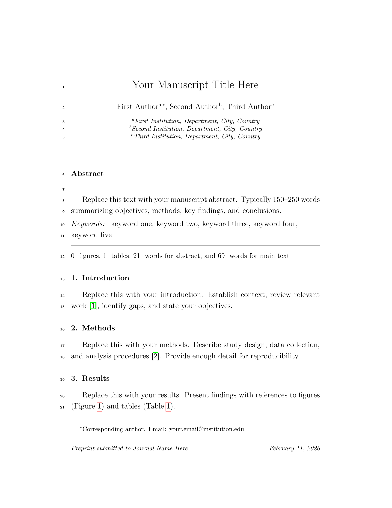
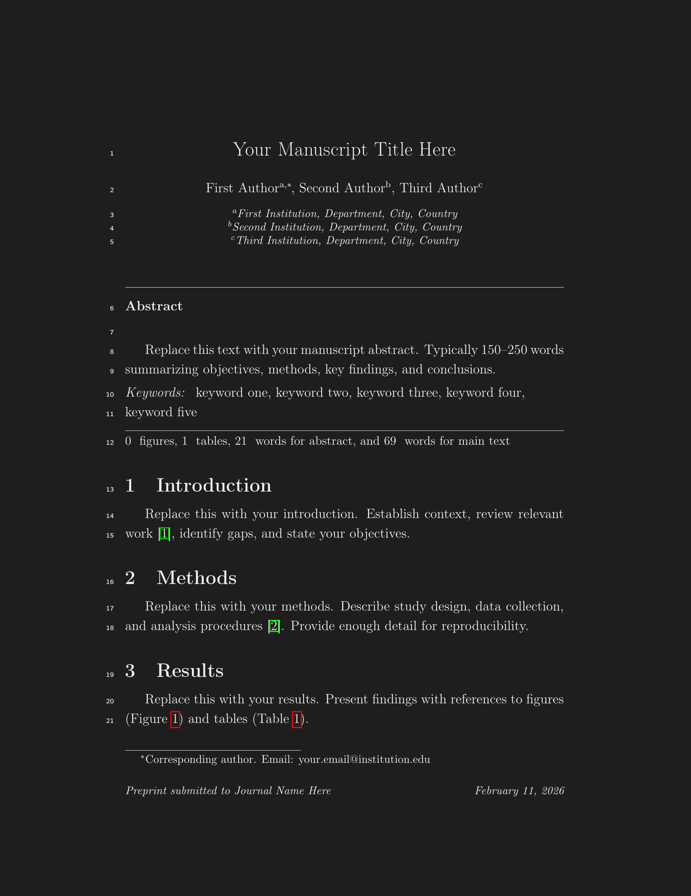
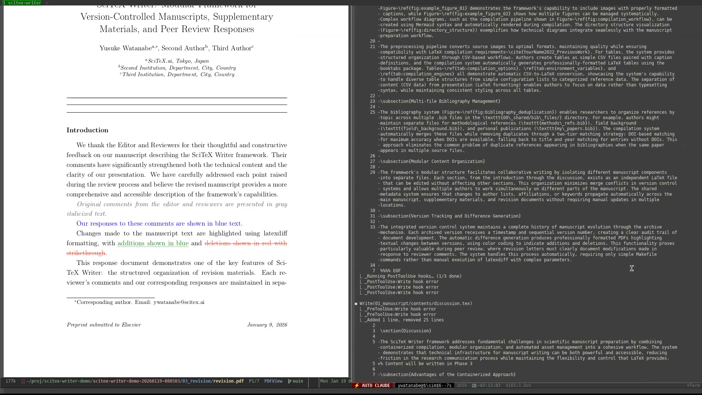
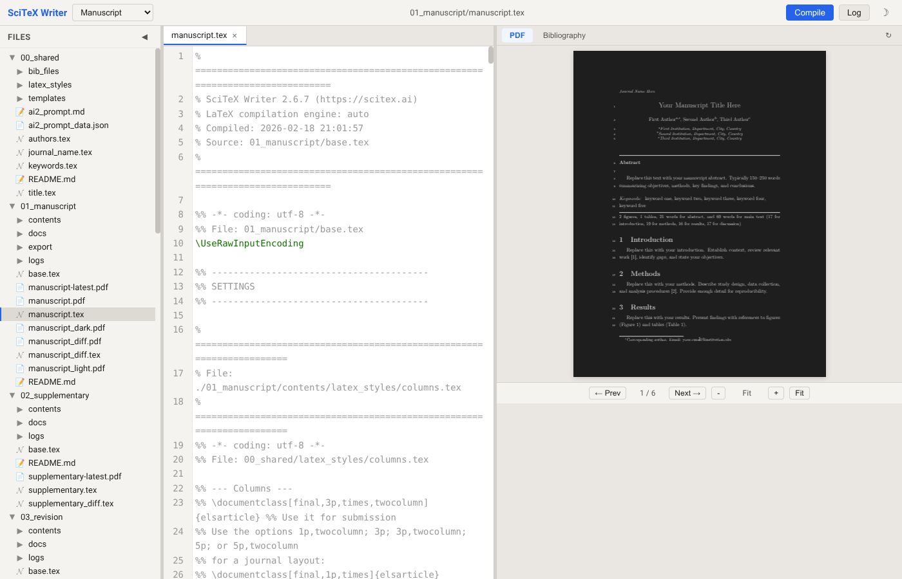
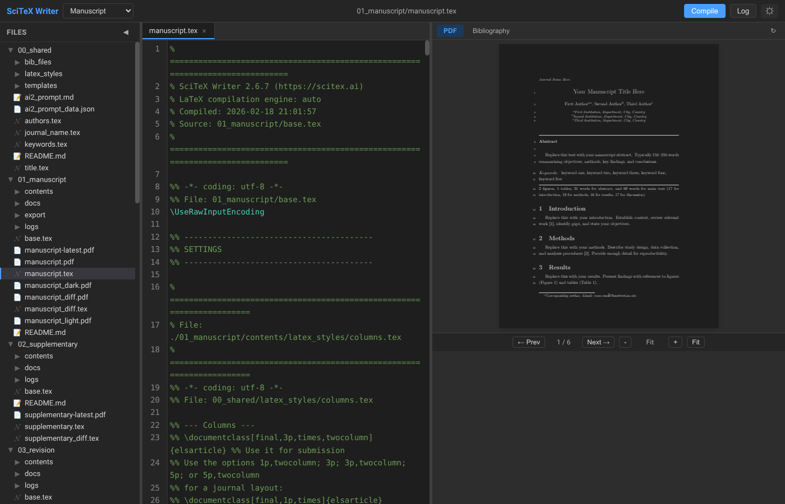

<!-- ---
!-- File: README.md
!-- --- -->

<p align="center">
  <a href="https://scitex.ai">
    
  </a>
</p>

# SciTeX Writer

<p align="center">
  <a href="https://badge.fury.io/py/scitex-writer"></a>
  <a href="https://pypi.org/project/scitex-writer/"></a>
  <a href="https://scitex-writer.readthedocs.io/"></a>
  <a href="https://github.com/ywatanabe1989/scitex-writer/blob/main/LICENSE"></a>
</p>

<p align="center">
  <a href="https://scitex.ai">scitex.ai</a> · <a href="https://scitex-writer.readthedocs.io/">docs</a> · <code>pip install scitex-writer</code>
</p>

---

**LaTeX compilation system for scientific manuscripts with automatic versioning, diff generation, and cross-platform reproducibility.**

Part of the [SciTeX](https://scitex.ai) ecosystem — empowers both human researchers and AI agents.

## Problem and Solution


| # | Problem | Solution |
|---|---------|----------|
| 1 | **LaTeX compilation is fragile** -- bib, figs, tables, cross-refs, supplement each have their own failure mode | **`scitex writer compile`** -- one command runs bibtex → latex → bibtex → latex twice; handles supplement + revision diffs |
| 2 | **Figures drift from manuscript** -- author renumbers a figure; half the references go stale; `\ref{}` silently prints `??` | **Reference check + float-order audit** -- `writer_check_references` + `writer_check_float_order` catch dangling `\ref{}` before submission |
| 3 | **Manuscript claims uncheckable** -- a paper asserts "t(58) = 2.34, p = .021"; reviewer has no way to verify | **Clew-backed claims** -- `writer_add_claim` binds each assertion to a source session + file hash; `writer_render_claims` exposes the verification DAG |

## Preview

<p align="center">
  
  &nbsp;&nbsp;
  
</p>
<p align="center">
  <em>Light mode (default) and dark mode (<code>--dark-mode</code>)</em>
</p>

<p align="center">
  <a href="https://scitex.ai/demos/watch/scitex-writer/">
    
  </a>
</p>
<p align="center">
  <em>Demo video with AI agent</em>
</p>

## Installation

```bash
# LaTeX dependencies (Ubuntu/Debian)
sudo apt-get install texlive-latex-extra latexdiff parallel imagemagick ghostscript

# LaTeX dependencies (macOS)
brew install texlive latexdiff parallel imagemagick ghostscript

# Python package + MCP server
pip install scitex-writer
```

## Quick Start

```bash
git clone https://github.com/ywatanabe1989/scitex-writer.git my-paper
cd my-paper && make manuscript   # or: ./compile.sh manuscript
```

## Problem

LaTeX compilation for scientific manuscripts is painful:

- **Environment inconsistency** — "It compiles on my machine" is not a solution when collaborating across Linux, macOS, WSL2, and HPC clusters.
- **Manual figure conversion** — Converting between PNG, SVG, PDF, Mermaid, and TIFF formats by hand wastes time and introduces errors.
- **No version tracking** — Generating tracked-change diffs between revisions requires manual `latexdiff` invocations and careful file management.
- **Fragmented tooling** — Separate workflows for compilation, bibliography management, table formatting, and submission packaging.
- **AI agents cannot help** — Without a programmatic interface, AI assistants have no way to compile or manage manuscripts.

## Solution

SciTeX Writer solves each of these problems:

- **Container-based reproducible compilation** — Consistent builds across all platforms via Docker, Singularity, or native installation with automatic engine selection (Tectonic, latexmk, or 3-pass).
- **Automatic asset conversion** — Figures and tables are converted in parallel from source formats (PNG, SVG, comma-separated values (CSV), Mermaid) to LaTeX-ready output.
- **Built-in version tracking with diff generation** — Every compilation archives the previous version and generates a `latexdiff` document automatically.
- **Unified interface** — One tool for compilation, bibliography deduplication, figure/table management, and arXiv export packaging.
- **39 Model Context Protocol (MCP) tools for AI agents** — AI assistants can compile, edit, and manage manuscripts programmatically.

## Four Interfaces

| Interface | For | Description |
|-----------|-----|-------------|
| **Python API** | Human researchers | `import scitex_writer as sw` |
| **Command-Line Interface (CLI) Commands** | Terminal users | `scitex-writer compile`, `scitex-writer bib` |
| **MCP Tools** | AI agents | 39 tools for Claude/GPT integration |
| **Skills** | AI agent discovery | Workflow guides for capabilities and patterns |

<details>
<summary><strong>Python API</strong></summary>

**Compile** — Build PDFs

```python
import scitex_writer as sw

sw.compile.manuscript("./my-paper")                    # Full compile
sw.compile.manuscript("./my-paper", draft=True)       # Fast draft mode
sw.compile.supplementary("./my-paper")
sw.compile.revision("./my-paper", track_changes=True)
```

**Export** — arXiv Submission

```python
sw.export.manuscript("./my-paper")                     # arXiv-ready tarball
sw.export.manuscript("./my-paper", output_dir="/tmp")  # Custom output dir
```

**Tables/Figures/Bib** — Create, Read, Update, Delete (CRUD) Operations

```python
# Tables
sw.tables.list("./my-paper")
sw.tables.add("./my-paper", "results", "a,b\n1,2", "Results summary")
sw.tables.remove("./my-paper", "results")

# Figures
sw.figures.list("./my-paper")
sw.figures.add("./my-paper", "fig01", "./plot.png", "My figure")
sw.figures.remove("./my-paper", "fig01")

# Bibliography
sw.bib.list_files("./my-paper")
sw.bib.add("./my-paper", "@article{Smith2024, title={...}}")
sw.bib.merge("./my-paper")  # Merge + deduplicate
```

**Guidelines** — Introduction, Methods, Results, and Discussion (IMRAD) Writing Tips

```python
sw.guidelines.get("abstract")
sw.guidelines.build("abstract", draft="Your draft...")
sw.guidelines.list_sections()  # ['abstract', 'introduction', 'methods', 'discussion', 'proofread']
```

**Prompts** — AI2 Asta

```python
from scitex_writer import generate_asta
result = generate_asta("./my-paper", search_type="related")
```

**GUI** — Browser-based Editor

```python
sw.gui("./my-paper")                              # Launch editor
sw.gui("./my-paper", port=8080, dark_mode=True)  # Custom options
```

</details>

<details>
<summary><strong>CLI Commands</strong></summary>

```bash
scitex-writer --help                           # Show all commands

# Compile - Build PDFs
scitex-writer compile manuscript               # Compile manuscript
scitex-writer compile manuscript --draft       # Fast single-pass
scitex-writer compile supplementary            # Compile supplementary
scitex-writer compile revision                 # Compile revision letter

# Export - arXiv submission
scitex-writer export manuscript               # Package for arXiv upload

# Bibliography - Reference management
scitex-writer bib list-files                   # List .bib files
scitex-writer bib list-entries                 # List all entries
scitex-writer bib get Smith2024                # Get specific entry
scitex-writer bib add '@article{...}'          # Add entry
scitex-writer bib remove Smith2024             # Remove entry
scitex-writer bib merge                        # Merge and deduplicate

# Tables - CSV to LaTeX management
scitex-writer tables list                      # List tables
scitex-writer tables add results data.csv "Caption"
scitex-writer tables remove results

# Figures - Image management
scitex-writer figures list                     # List figures
scitex-writer figures add fig01 plot.png "Caption"
scitex-writer figures remove fig01

# Guidelines - IMRAD writing tips
scitex-writer guidelines list                  # List available sections
scitex-writer guidelines abstract              # Get abstract guidelines
scitex-writer guidelines abstract -d draft.tex # Build prompt with draft

# Prompts - AI2 Asta integration
scitex-writer prompts asta                     # Generate related papers prompt
scitex-writer prompts asta -t coauthors        # Find collaborators

# MCP server management
scitex-writer mcp list-tools                   # List all MCP tools (markdown)
scitex-writer mcp doctor                       # Check server health
scitex-writer mcp installation                 # Show Claude Desktop config
scitex-writer mcp start                        # Start MCP server

# GUI - Browser-based editor
scitex-writer gui                              # Launch editor (current dir)
scitex-writer gui ./my-paper                   # Open specific project
scitex-writer gui --port 8080 --no-browser     # Custom port, no auto-open
```

</details>

<details>
<summary><strong>MCP Tools — 39 tools for AI Agents</strong></summary>

Turn AI agents into autonomous manuscript compilers.

| Category | Tools | Description |
|----------|-------|-------------|
| project | 4 | Clone, info, PDF paths, document types |
| compile | 4 | Manuscript, supplementary, revision, content |
| tables | 5 | CSV to LaTeX, list/add/remove tables |
| figures | 5 | Convert, render PDF, list/add/remove |
| bib | 6 | List files/entries, CRUD, merge/dedupe |
| guidelines | 3 | List, get, build with draft |
| prompts | 1 | AI2 Asta prompt generation |
| export | 1 | arXiv-ready tarball packaging |
| claim | 6 | Traceable scientific assertions |
| migration | 2 | Overleaf import/export |
| update | 1 | Template update from upstream |

**Claude Desktop** (`~/.config/Claude/claude_desktop_config.json`):

```json
{
  "mcpServers": {
    "scitex-writer": {
      "command": "scitex-writer",
      "args": ["mcp", "start"]
    }
  }
}
```

> **[Full MCP tool reference](./docs/MCP_TOOLS.md)**

</details>

<details>
<summary><strong>Skills — for AI Agent Discovery</strong></summary>

<br>

Skills provide workflow-oriented guides that AI agents query to discover capabilities and usage patterns.

```bash
scitex-writer skills list              # List available skill pages
scitex-writer skills get SKILL         # Show main skill page
scitex-dev skills export --package scitex-writer  # Export to Claude Code
```

| Skill | Content |
|-------|---------|
| `quick-start` | Basic manuscript workflow |
| `compilation` | Compile manuscript, supplementary, revision |
| `bibliography` | BibTeX management, enrichment |
| `figures-and-tables` | Figure/table insertion and conversion |
| `claims` | Claim tracking and rendering |
| `cli-reference` | CLI commands |
| `mcp-tools` | MCP tools for AI agents |
| `writing-attitude` | Evidence requirements, scientific standards |
| `writing-figures-stats` | Figure rules, statistical reporting |
| `writing-proofreading` | Proofreading corrections, language rules |
| `writing-abstract` | Abstract template with 7-section structure |
| `writing-introduction` | Introduction template with 8-section structure |
| `writing-methods` | Methods template with reproducibility guidelines |
| `writing-discussion` | Discussion template with 5-section structure |
| `audit-paper` | Comprehensive pre-submission manuscript audit |

</details>

<details>
<summary><strong>Additional Interfaces</strong></summary>

**Shell Scripts / Make** — Direct compilation without Python.

```bash
make manuscript              # Compile manuscript
make supplementary           # Compile supplementary
make revision                # Compile revision
make all                     # Compile all documents
make manuscript-export       # Package for arXiv submission
make clean                   # Remove build artifacts
./compile.sh manuscript --draft       # Fast single-pass
./compile.sh manuscript --no-figs     # Skip figures
./compile.sh manuscript --dark-mode   # Dark mode (Monaco theme)
./compile.sh manuscript --watch       # Hot-reload
SCITEX_WRITER_DARK_MODE=true make manuscript
```

**GUI Editor** — Standalone browser-based editor with file tree, PDF preview, and compilation controls.

<p align="center">
  
  &nbsp;&nbsp;
  
</p>

```bash
pip install scitex-writer[editor]
scitex-writer gui                    # Current directory
scitex-writer gui ./my-paper         # Specific project
scitex-writer gui --port 8080        # Custom port
```

</details>

<details>
<summary><strong>Output Structure</strong></summary>

```
./scitex-writer/
├── 00_shared/                  # Shared resources across all documents
│   ├── title.tex / authors.tex / keywords.tex / journal_name.tex
│   ├── bib_files/              # Multiple .bib files (auto-merged and deduplicated)
│   ├── latex_styles/           # Common LaTeX configurations
│   └── templates/              # LaTeX document templates
├── 01_manuscript/              # Main manuscript
│   ├── contents/               # abstract, introduction, methods, results, discussion
│   │   ├── figures/            # Figure captions + media
│   │   └── tables/             # Table captions + CSV data
│   ├── archive/                # Version history (gitignored)
│   ├── manuscript.tex          # Compiled LaTeX
│   ├── manuscript_diff.tex     # Change-tracked version
│   └── manuscript.pdf          # Output PDF
├── 02_supplementary/           # Supplementary materials (same structure)
├── 03_revision/                # Revision response letter
│   └── contents/               # editor/, reviewer1/, reviewer2/
├── config/                     # config_manuscript.yaml
└── scripts/                    # containers, installation, shell, python
```

</details>

## Features

<details>
<summary><strong>Details</strong></summary>

| Feature                | Description                                                           |
|------------------------|-----------------------------------------------------------------------|
| **Separated Files**    | Modular sections (abstract, intro, methods, results, discussion)      |
| **Built-in Templates** | Pre-configured manuscript, supplementary materials, and revision      |
| **Bibliography**       | Multi-file with auto-deduplication, 20+ citation styles               |
| **Assets**             | Parallel figure/table processing (PNG, PDF, SVG, Mermaid, CSV)        |
| **GUI Editor**         | Browser-based editor with PDF preview (`scitex-writer gui`)           |
| **Dark Mode**          | Monaco/VS Code dark theme for comfortable reading (`--dark-mode`)     |
| **Multi-Engine**       | Auto-selects best engine (Tectonic 1-3s, latexmk 3-6s, 3-pass 12-18s) |
| **Cross-Platform**     | Linux, macOS, WSL2, Docker, Singularity, HPC clusters                 |

</details>

## Usage

<details>
<summary><strong>PDF Compilation</strong></summary>

```bash
# Basic compilation
./scripts/shell/compile_manuscript.sh          # Manuscript
./scripts/shell/compile_supplementary.sh       # Supplementary
./scripts/shell/compile_revision.sh            # Revision letter

# Performance options
./scripts/shell/compile_manuscript.sh --draft      # Fast single-pass
./scripts/shell/compile_manuscript.sh --no-figs    # Skip figures
./scripts/shell/compile_manuscript.sh --no-tables  # Skip tables
./scripts/shell/compile_manuscript.sh --no-diff    # Skip diff generation

# Engine selection
./scripts/shell/compile_manuscript.sh --engine tectonic  # Fastest
./scripts/shell/compile_manuscript.sh --engine latexmk   # Standard
./scripts/shell/compile_manuscript.sh --engine 3pass     # Most compatible

# Development
./scripts/shell/compile_manuscript.sh --watch  # Hot-reload on file changes
./scripts/shell/compile_manuscript.sh --clean  # Remove cache
```

</details>

<details>
<summary><strong>Figures</strong></summary>

1. Place media files in `01_manuscript/contents/figures/caption_and_media/`:
   ```
   01_example_figure.png
   01_example_figure.tex  # Caption file
   ```

2. Caption file format (`01_example_figure.tex`):
   ```latex
   %% Figure caption
   \caption{Your figure caption here. Explain panels (A, B, C) if applicable.}
   \label{fig:example_figure_01}
   ```

3. Supported formats: PNG, JPEG, PDF, SVG, TIFF, Mermaid (.mmd)

4. Figures auto-compile and include in `FINAL.tex`

</details>

<details>
<summary><strong>Tables</strong></summary>

1. Place CSV + caption in `01_manuscript/contents/tables/caption_and_media/`:
   ```
   01_example_table.csv
   01_example_table.tex  # Caption file
   ```

2. CSV auto-converts to LaTeX table format

3. Caption file format (`01_example_table.tex`):
   ```latex
   %% Table caption
   \caption{Your table caption. Define abbreviations used.}
   \label{tab:example_table_01}
   ```

</details>

<details>
<summary><strong>References</strong></summary>

Organize references in multiple `.bib` files - they auto-merge with deduplication:

```bash
00_shared/bib_files/
├── methods_refs.bib      # Method-related references
├── field_background.bib  # Background literature
└── my_papers.bib         # Your own publications
```

Change citation style in `config/config_manuscript.yaml`:
- `unsrtnat` (numbered, order of citation)
- `plainnat` (numbered, alphabetical)
- `apalike` (author-year, APA style)
- `IEEEtran` (IEEE format)
- `naturemag` (Nature style)

</details>

## Documentation

<details>
<summary><strong>Details</strong></summary>

| Guide | Description |
|-------|-------------|
| [Installation](docs/01_GUIDE_INSTALLATION.md) | Setup for all environments |
| [Quick Start](docs/01_GUIDE_QUICK_START.md) | Common workflows |
| [Content Creation](docs/01_GUIDE_CONTENT_CREATION.md) | Writing manuscripts |
| [Bibliography](docs/01_GUIDE_BIBLIOGRAPHY.md) | Reference management |
| [Architecture](docs/02_ARCHITECTURE_IMPLEMENTATION.md) | Technical details |

</details>

## Part of SciTeX

SciTeX Writer is part of [SciTeX](https://scitex.ai). When used inside the orchestrator package `scitex`, synergy between modules enables end-to-end scientific workflows — from data analysis through publication-ready manuscripts.

The SciTeX ecosystem follows the **Four Freedoms** for researchers, inspired by [the Free Software Definition](https://www.gnu.org/philosophy/free-sw.en.html):

0. **Use** — Run the software for any research purpose
1. **Study** — Examine how it works and adapt it to your needs
2. **Share** — Distribute copies to fellow researchers
3. **Improve** — Enhance the software and share improvements with the community

---

<p align="center">
  <a href="https://scitex.ai" target="_blank"></a>
  <br>
  AGPL-3.0
</p>

<!-- EOF -->
