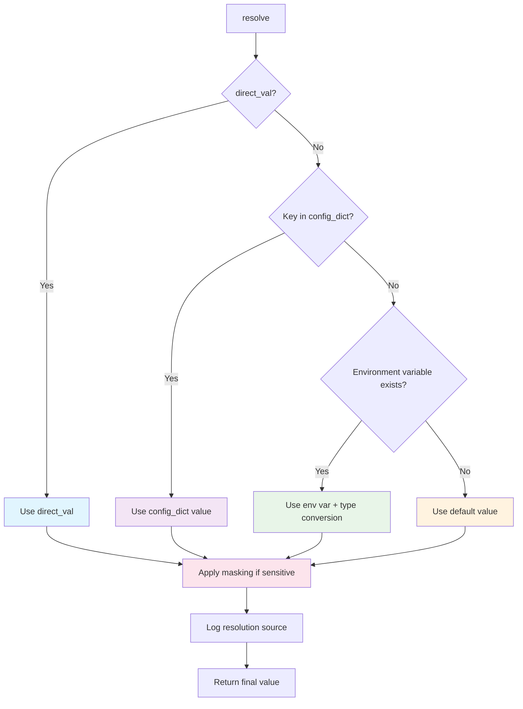

<!-- ---
!-- Timestamp: 2025-09-01 08:22:12
!-- Author: ywatanabe
!-- File: /home/ywatanabe/.dotfiles/.claude/to_claude/guidelines/python/OFFICIAL/priority-config-README.md
!-- --- -->

# Priority Config

Universal configuration resolver with clean precedence hierarchy: **direct → config → env → default**

[](https://www.python.org/downloads/)
[](https://pypi.org/project/priority-config/)
[](https://opensource.org/licenses/MIT)

## Installation

```bash
pip install priority-config
```

## Quick Start

```python
from priority_config import PriorityConfig

# Create config resolver
config = PriorityConfig(
    config_dict={"port": 3000, "debug": True},
    env_prefix="MYAPP_"
)

# Resolve with precedence
port = config.resolve("port", None, default=8000, type=int)
# Returns: 3000 (from config_dict)

debug = config.resolve("debug", False, default=True, type=bool)
# Returns: False (direct_value takes precedence)

# Environment variables (MYAPP_HOST) override config
host = config.resolve("host", default="localhost")
# Returns: value from MYAPP_HOST env var, or "localhost"

# See resolution log
config.print_resolutions()
# Configuration Resolution Log:
# --------------------------------------------------
# port                 = 3000                 (config)
# debug                = 0                    (direct)
# host                 = localhost            (default)
```

## How It Works

The configuration resolution follows a clean precedence hierarchy:



**Precedence Order:**
1. **Direct value** - Passed directly to `resolve()`
2. **Config dictionary** - From `config_dict` parameter
3. **Environment variable** - With `env_prefix` + key
4. **Default value** - Fallback if nothing else found

## Features

- **Clean Precedence**: `direct → config → env → default`
- **Automatic Type Conversion**: `str`, `int`, `float`, `bool`, `list`
- **Sensitive Data Masking**: Auto-detects and masks passwords, keys, tokens
- **Resolution Logging**: Track where each value came from
- **Zero Dependencies**: Pure Python, works with 3.8+

## API Reference

### `PriorityConfig(config_dict=None, env_prefix="", auto_uppercase=True)`

- `config_dict`: Dictionary with configuration values
- `env_prefix`: Prefix for environment variables (e.g., "MYAPP_")
- `auto_uppercase`: Whether to uppercase keys for env lookup

### `resolve(key, direct_val=None, default=None, type=str, mask=None)`

- `key`: Configuration key to resolve
- `direct_val`: Direct value (highest precedence)
- `default`: Default value if not found elsewhere
- `type`: Type conversion (`str`, `int`, `float`, `bool`, `list`)
- `mask`: Override automatic masking of sensitive values

### `print_resolutions()`

Print resolution log showing where each value came from.

### `clear_log()`

Clear the resolution log.

## License

MIT

## Contact
Yusuke.Watanabe@scitex.ai

<!-- EOF -->