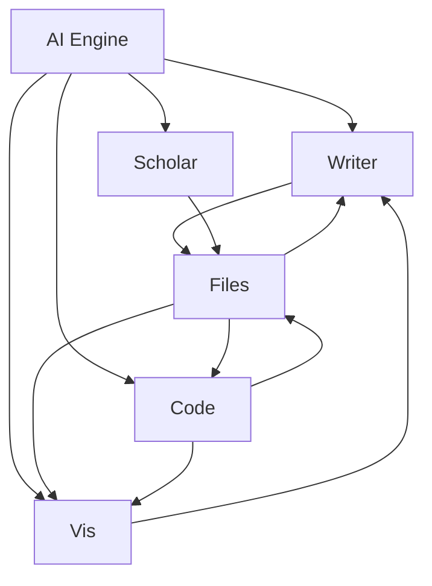
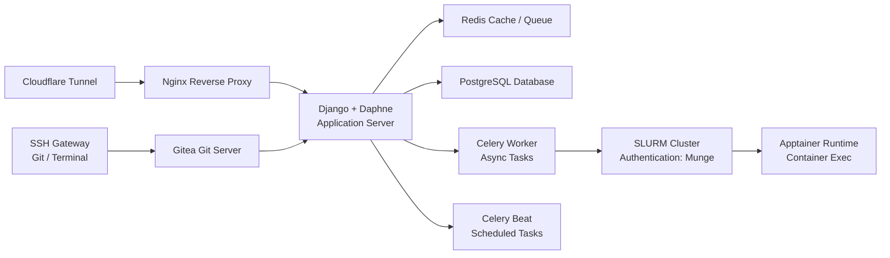

# Mermaid Academic Figure Style Guide

Scientific and engineering diagrams for publications and technical documentation.

## 1. General Principles

- Clarity over decoration
  - Avoid gradients, shadows, rounded corners unless necessary
  - Keep node shapes consistent within a diagram
  - Prefer simple rectangular or hexagonal nodes

- Semantic coloring (using custom RGB palette)
  - Modules / components: blue, navy, lightblue
  - Data stores: yellow, orange
  - AI / computation: red, purple
  - External integrations: green
  - Neutral / glue systems: gray

- Directional flow
  - Prefer top to bottom (conceptual to implementation)
  - Or left to right for pipelines
  - Avoid crossing edges when possible

- Edge labeling
  - Label edges only when needed
  - Keep labels short (e.g., "API", "SSH", "SLURM job")

- Typography
  - Use concise component names
  - For academic diagrams: no emojis, no decorative characters

- Node spacing
  - Provide enough spacing to avoid visual clutter

## 2. Mermaid Theme Template

Use this snippet at the top of your file:

```mermaid
%% Academic Mermaid Theme
%% Define your custom palette
%% Colors converted to hex for Mermaid:

%% white     #FFFFFF
%% black     #000000
%% blue      #0080C0
%% red       #FF4632
%% pink      #FF96C8
%% green     #14B414
%% yellow    #E6A014
%% gray      #808080
%% purple    #C832FF
%% lightblue #14C8C8
%% brown     #800000
%% navy      #000064
%% orange    #E45E32

%% Custom Classes
classDef module      fill:#0080C0,stroke:#000000,stroke-width:1px,color:#FFFFFF;
classDef ai          fill:#FF4632,stroke:#000000,stroke-width:1px,color:#FFFFFF;
classDef data        fill:#E6A014,stroke:#000000,stroke-width:1px,color:#000000;
classDef service     fill:#808080,stroke:#000000,stroke-width:1px,color:#FFFFFF;
classDef compute     fill:#C832FF,stroke:#000000,stroke-width:1px,color:#FFFFFF;
classDef storage     fill:#14C8C8,stroke:#000000,stroke-width:1px,color:#000000;
classDef external    fill:#14B414,stroke:#000000,stroke-width:1px,color:#000000;
```

You can extend or rename these classes as necessary.

## 3. Recommended Node Shapes

Use these shapes consistently:

- System Modules: rect (for Writer, Code, Vis, Scholar, Files)
- AI / Compute Layers: hexagon (for AI Engine, LLM, Scheduler)
- Databases / Storage: cylinders (for PostgreSQL, Redis, TempStorage)
- External Services / API: rounded rect (for Cloudflare, Nginx, SSH Gateway)

## 4. Example: Academic-Style Architecture Diagram



This produces a clean, research-paper-grade diagram with a consistent palette.

## 5. Example: System Architecture (Infrastructure)



## 6. Guidelines for Scientific Readability

- Show layers
  - Presentation layer
  - Application layer
  - Service layer
  - Storage layer
  - Compute layer

- Show direction
  - Use arrows consistently
  - Top to bottom for conceptual to implementation
  - Left to right for workflows

- Reduce color noise
  - Use at most 4-5 colors in one diagram

- Avoid long node names
  - If needed, place details in a footnote, not the box

- Keep edges straight
  - Minimize curved edges unless visual clarity demands it

## 7. Reusable Prompt for Mermaid Academic Diagrams

Use this prompt when generating diagrams:

```
You are a scientific diagram generator.
Produce a Mermaid diagram that follows academic conventions:

1. Use simple rectangular or hexagonal shapes
2. No shadows, emojis, or unnecessary decoration
3. Use the following color palette:
   - Modules: blue (#0080C0)
   - AI/Compute: red (#FF4632) or purple (#C832FF)
   - Databases/Storage: yellow (#E6A014) or lightblue (#14C8C8)
   - External/Proxy: green (#14B414) or gray (#808080)
4. Use top-to-bottom or left-to-right logical flow
5. Avoid crossing edges; keep layout clean
6. Use labels only when necessary
7. Produce code that includes a classDef block for styling
8. Output only Mermaid code

Generate a clear, research-grade diagram that could be included in a scientific publication.
```
